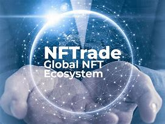

>## *Predict Bitcoin prices with LSTM*  
#

 

#

>### Overview: 
>> This script will *Build* & *Crowdsale* ERC20 tokens to help fund a specific cause using Solidity Smary Contracts.

<!--  -->
 

>## What is Crowdfunding?
> [Hivelr](https://www.hivelr.com/2020/12/what-is-crowdfunding/): Crowdfunding is a process of raising capital in small increments from many investors using an online platform. It is the most popular way for entrepreneurs to get money and launch their businesses. On the other hand, traditional financing like a bank loan requires collateral, credit check, and due diligence.
>

>## Are NFTs the future?
> [Vlaa](https://vlaa.org/the-future-of-nfts/#:~:text=While%20the%20future%20of%20the%20world%20of%20NFTs,an%20NFT%20while%20the%20market%20is%20still%20booming.): While the future of the world of NFTs is uncertain, it is currently a lucrative method for some artists to sell their creations to collectors and have the chance to make a large profit. Anyone who creates content on the Internet may want to consider attempting to sell their work as an NFT while the market is still booming.

>

 

#

 

## Resources:
1. Northwestern NPS:
https://sps.northwestern.edu/

2. Hivelr:
https://www.hivelr.com/2020/12/what-is-crowdfunding/

3. Vlaa:
https://vlaa.org/the-future-of-nfts/#:~:text=While%20the%20future%20of%20the%20world%20of%20NFTs,an%20NFT%20while%20the%20market%20is%20still%20booming.
